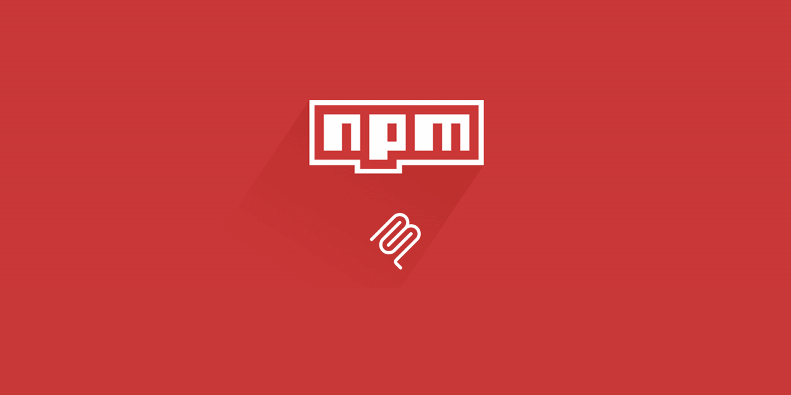

<div align="center">



# NPM MCP

**Model Context Protocol server for npm registry**

Search packages, check security, compare versions, and validate compatibility. Use it from Cursor AI or Claude Desktop.

> **Note:** This is an unofficial, community-driven MCP server and is not affiliated with or endorsed by npm, Inc.

</div>

## Features

- **Auto-Security** — AI automatically checks packages before suggesting install (no user action!)
- **Capabilities Analysis** — ESM/CJS, TypeScript, Platform support (Node/Browser/Deno), Build tools
- **Quick Start Generator** — Ready-to-use code examples for any package
- **Package Comparison** — Compare alternatives side-by-side (features, size, popularity)
- **Bundle Size Analysis** — Minified/gzipped sizes, tree-shaking, impact on your bundle
- **Similar Packages** — Find alternatives and similar packages
- **Search** — Find packages with ranking and scores
- **Details** — Versions, dependencies, download stats, deprecation status
- **Security** — Vulnerability check and safe version tips
- **Compatibility** — Peer dependency and version conflicts
- **Quality** — Maintenance and community metrics
- **Version compare** — Breaking changes and semver
- **NPX check** — Validate npx commands before running

## Install & use

### With npx (recommended)

No global install. Add to Cursor or Claude config:

**Cursor** — `~/.cursor/mcp.json`:

```json
{
  "mcpServers": {
    "npm-registry-mcp": {
      "command": "npx",
      "args": ["@alisaitteke/npm-mcp"]
    }
  }
}
```

**Claude Desktop** — `~/Library/Application Support/Claude/claude_desktop_config.json` (macOS):

```json
{
  "mcpServers": {
    "npm-registry-mcp": {
      "command": "npx",
      "args": ["@alisaitteke/npm-mcp"]
    }
  }
}
```

### Global install (optional)

```bash
npm install -g @alisaitteke/npm-mcp
```

Then use `"command": "npm-mcp"` (no `args`) in the config above.

## What you can ask

Once the server is connected, you can ask things like:

- “Search for React state management libraries”
- “Security audit for express@4.18”
- “Is lodash@4.17 compatible with my current deps?”
- “Compare React 17 and 18”
- “Quality check for date-fns”
- “Is it safe to run npx create-next-app?”

## Links

- **MCP Capabilities**: [MCP_CAPABILITIES.md](./MCP_CAPABILITIES.md) — What this MCP ACTUALLY does (NOT just metadata!)
- **Developer Productivity**: [PRODUCTIVITY.md](./PRODUCTIVITY.md) — Quick start, comparison, bundle size, alternatives
- **Package Capabilities**: [CAPABILITIES.md](./CAPABILITIES.md) — ESM/CJS, TypeScript, Platform support analysis
- **Automatic Security Checks**: [AUTOMATIC.md](./AUTOMATIC.md) — How AI auto-checks packages (no user action needed!)
- **Web Search Fallback**: [WEB_FALLBACK.md](./WEB_FALLBACK.md) — Auto-correction when AI uses web search
- **Tool Descriptions**: [TOOL_DESCRIPTIONS.md](./TOOL_DESCRIPTIONS.md) — How AI knows when to use MCP
- **Smart Prompts (Slash Commands)**: [PROMPTS.md](./PROMPTS.md) — Use `/check_before_install`, `/find_package`, `/audit_project`
- **Testing Guide**: [TESTING.md](./TESTING.md) — Verify automatic triggers work correctly
- **AI Auto-trigger Setup**: [AI_USAGE.md](./AI_USAGE.md) — Additional rules for `.cursorrules` (optional)
- **Development** (setup, tests, architecture): [DEVELOPMENT.md](./DEVELOPMENT.md)
- **Contributing**: [CONTRIBUTING.md](./CONTRIBUTING.md)

## Files included for users

- **`AI_USAGE.md`** — Instructions for making AI automatically use MCP tools (copy rules to your project)

## License

MIT

## Contributors

<table>
  <tr>
    <td align="center">
      <a href="https://github.com/alisaitteke">
        
        <br />
        <sub><b>Ali Sait Teke</b></sub>
      </a>
      <br />
      <sub>Creator & Maintainer</sub>
    </td>
  </tr>
</table>

Thanks to everyone who helps improve this project!

[](https://github.com/alisaitteke/npm-mcp/graphs/contributors)
